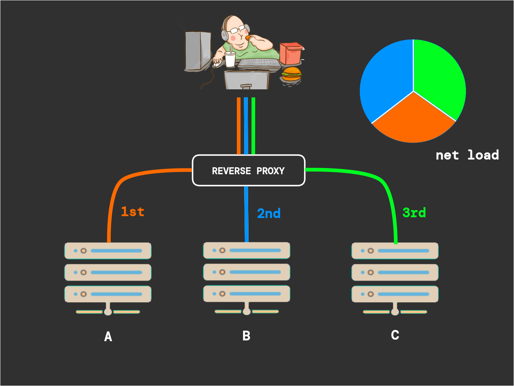

<p align="right">
  <a href="https://holbertonschool.uy/" target="_blank" style="border:0;">
    
  </a>
</p>

# Holbertonschool - Softy Pinko Docker

Containerized app infrastructure with Docker – reverse proxy, load balancer (Round Robin), two API servers, and a front-end server for scalable, portable deployment.


-3c99d9?style=for-the-badge&logo=docker&logoColor=white)


If you get this warning:

`- JSONArgsRecommended: JSON arguments recommended for CMD to prevent unintended behavior related to OS signals (line 6)`

User this syntax instead:
```Dockerfile
CMD ["echo", "Hello, World!"]
# instead of this: CMD echo "Hello, World!"
```


## Index

1) [Context](#context)
2) [Docker commands](#some-useful-docker-commands)
    * [Build image](#build-image)
    * [Run container](#run-the-container)

## Resources

* [Docker Tutorial](https://docs.docker.com/get-started/introduction/)
* [Install docker on Linux](https://docs.docker.com/desktop/setup/install/linux/)
* [Install docker on Windows](https://docs.docker.com/desktop/setup/install/windows-install/)

## Context

Docker is a tool that packages applications and all their necessary components (like libraries and configurations) into isolated environments called containers. This makes applications portable, allowing them to run consistently on any machine, from a developer's laptop to a production server.

The main benefits of using Docker are that its containers are lightweight, fast, and simplify the process of deploying and scaling applications. For the project described, <strong>you will use Docker to build a complete application infrastructure, including a reverse proxy, a load balancer, and multiple servers.</strong>



* <i>Each colored line is a different request/response. Also, Imagine theres a cloud between the user and the reverse proxy, a forward proxy can sit between the client and the cloud. Also there can be (and usually are) many clients connected simultaneously to the same proxy.</i>

* <i>A, B and C represent clusters.</i>


## Some useful docker commands

<i> * When installing packages through the Dockerfile, what's the `-y` apt-get flag you might ask.
It automatically answers `yes` to all prompts during installation.</i>

<i>* You might also need to specify `sudo` in order to build the images on linux, I don't know about Windows.</i>

### List Docker images

```bash
$ docker images
# or: docker image ls
```

### Build image

This will look for a `Dockerfile` so make sure your cwd contains one.
```bash
$ docker build -t <your-docker-image> .
```

  * `docker build`: This is the command to build an image from a Dockerfile.

  * `-t <your-docker-image>`: The -t flag is used to tag the image with a name. I've used `<your-docker-image>` as an example, but you can choose any name you like.

  * `.`: The dot at the end of the command specifies that the build context is the current directory (where your Dockerfile is located).

Or you can use the `-f` flag to specifiy a path to your `Dockerfile` For example the following command points to a  Dockerfile   in a different location, with a different name and a different environment:
```bash
$ docker build -f ./docker/Dockerfile.prod -t my-app:prod .
```

### Run the container

One the image is fully built, use this command to run the container.
```bash
$ docker run <your-docker-image>
```
  * `docker run`: Creates and starts the new container.

  * `<your-docker-image>`: The name of the image to run.
<br><br>

  In the provided command `docker run -it --rm --name softy-pinko-task0 softy-pinko:task0`:

  * `-it`: This is two combined flags:
    * `-i`: Keeps `STDIN` open. I stands for <strong>Interactive</strong>.
    * `-t`: Gives you a pretty terminal inside the container, T stands for <strong>tty</strong>.
  * `--rm`: Removes the container when it finishes loading up everything.
  * `--name`: If not specified, docker will give your container a random name like `sexy-lumberjack`

### <p align=center>[Back to Top](#holbertonschool---softy-pinko-docker)</p>