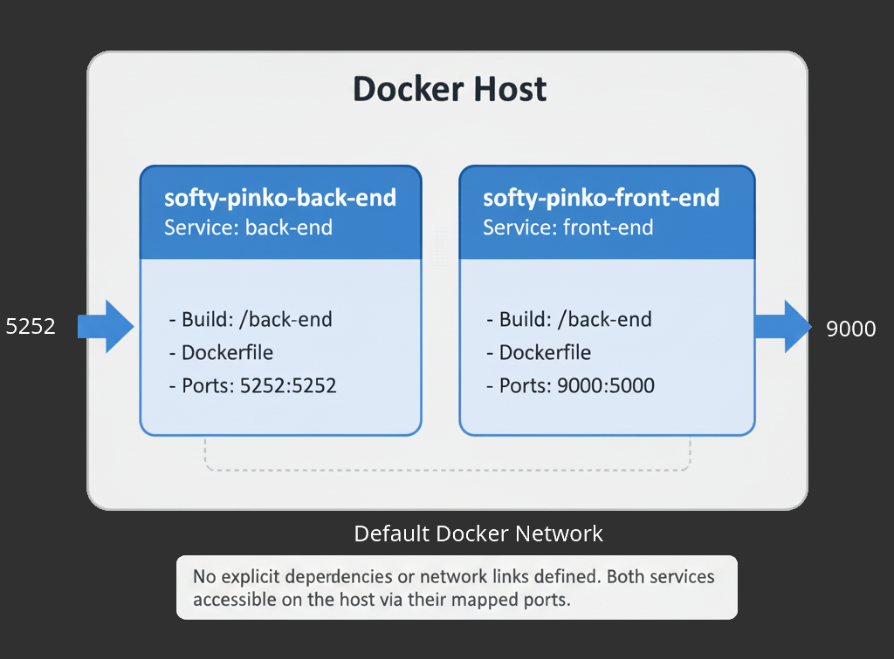

<p align="right">
  <a href="https://holbertonschool.uy/" target="_blank" style="border:0;">
    
  </a>
</p>

# Holbertonschool - Softy Pinko Docker

Containerized app infrastructure with Docker – reverse proxy, load balancer (Round Robin), two API servers, and a front-end server for scalable, portable deployment.


-3c99d9?style=for-the-badge&logo=docker&logoColor=white)


### If you get this warning:

`- JSONArgsRecommended: JSON arguments recommended for CMD to prevent unintended behavior related to OS signals (line 6)`

User this syntax instead:
```Dockerfile
CMD ["echo", "Hello, World!"]
# instead of this: CMD echo "Hello, World!"
```


## Index

1) [Context](#context)
2) [Docker commands](#some-useful-docker-commands)
    * [Build image](#build-image)
    * [Run container](#run-the-container)
    * [Task 3 Notes](#task-3-notes)
    * [Task 4 Notes](#task-4-notes)
    * [Task 5 Notes](#task-5-notes)
    * [Task 6 Notes](#task-6-notes)

## Resources

* [Docker Tutorial](https://docs.docker.com/get-started/introduction/)
* [Install docker on Linux](https://docs.docker.com/desktop/setup/install/linux/)
* [Install docker on Windows](https://docs.docker.com/desktop/setup/install/windows-install/)

## Context

Docker is a tool that packages applications and all their necessary components (like libraries and configurations) into isolated environments called containers. This makes applications portable, allowing them to run consistently on any machine, from a developer's laptop to a production server.

The main benefits of using Docker are that its containers are lightweight, fast, and simplify the process of deploying and scaling applications. For the project described, <strong>you will use Docker to build a complete application infrastructure, including a reverse proxy, a load balancer, and multiple servers.</strong>


* <i>Each colored line is a different request/response. Also, Imagine theres a cloud between the user and the reverse proxy, a forward proxy can sit between the client and the cloud. Also there can be (and usually are) many clients connected simultaneously to the same proxy.</i>

* <i>A, B and C represent clusters.</i>


## Some useful docker commands

<i> * When installing packages through the Dockerfile, what's the `-y` apt-get flag you might ask.
It automatically answers `yes` to all prompts during installation.</i>

<i>* You might also need to specify `sudo` in order to build the images on linux, I don't know about Windows.</i>

### List Docker images

```bash
$ docker images
# or: docker image ls
```

### Build image

This will look for a `Dockerfile` so make sure your cwd contains one.
```bash
$ docker build -t <your-docker-image> .
```

  * `docker build`: This is the command to build an image from a Dockerfile.

  * `-t <your-docker-image>`: The -t flag is used to tag the image with a name. I've used `<your-docker-image>` as an example, but you can choose any name you like.

  * `.`: The dot at the end of the command specifies that the build context is the current directory (where your Dockerfile is located).

Or you can use the `-f` flag to specifiy a path to your `Dockerfile` For example the following command points to a  Dockerfile   in a different location, with a different name and a different environment:
```bash
$ docker build -f ./docker/Dockerfile.prod -t my-app:prod .
```

### Run the container

One the image is fully built, use this command to run the container.
```bash
$ docker run <your-docker-image>
```
  * `docker run`: Creates and starts the new container.

  * `<your-docker-image>`: The name of the image to run.
<br><br>

  In the provided command `docker run -it --rm --name softy-pinko-task0 softy-pinko:task0`:

  * `-it`: This is two combined flags:
    * `-i`: Keeps `STDIN` open. I stands for <strong>Interactive</strong>.
    * `-t`: Gives you a pretty terminal inside the container, T stands for <strong>tty</strong>.
  * `--rm`: Removes the container when it finishes loading up everything.
  * `--name`: If not specified, docker will give your container a random name like `sexy-lumberjack`

### Task 3 Notes:

You should specify the requirements.txt for the python dependencies, specifically for `flask_cors`, create your `requirements.txt` and add this to your back-end `Dockerfile`:
```dockerfile
COPY requirements.txt .
RUN pip3 install -r requirements.txt
```
<i>*Remember to add `flask_cors` as a dependency.</i>

### Now you can run build and run both containers
* ### Back-end service
  <strong>Terminal 1</strong>
  #### Build the image:
  ```bash
  # Place your cwd at task3/
  # Build the Back-end Image
  ~/holbertonschool-softy-pinko-docker/task3$: sudo docker build -f ./back-end/Dockerfile -t softy-pinko-back-end:task3 ./back-end
  # ... Docker building...
  => => naming to docker.io/library/softy-pinko-back-end:task3
  # Docker finishes...
  ~/holbertonschool-softy-pinko-docker/task3$:
  ```
  <i>*Note that I'm using `sudo`</i>
  #### Now run the container:
  ```bash
  ~/holbertonschool-softy-pinko-docker/task3$: sudo docker run -p 5252:5252 -it --rm --name softy-pinko-back-end-task3 softy-pinko-back-end:task3
  # Now the Back-end container is running on port 5252.
  * Serving Flask app 'api'
  * Debug mode: off
  WARNING: This is a development server. Do not use it in a production deployment. Use a production WSGI server instead.
  * Running on all addresses (0.0.0.0)
  * Running on http://127.0.0.1:5252
  * Running on http://172.17.0.2:5252
      Press CTRL+C to quit
  ```
  <i>If you want to keep the containers after shutting them down, remove the `--rm` flag.</i>
* ### Front-end service
  <strong>Terminal 2</strong>
  #### Build the image:
  ```bash
  ~/holbertonschool-softy-pinko-docker/task3$ sudo docker build -f ./front-end/Dockerfile -t softy-pinko-front-end:task3 ./front-end
  ```
  #### Run the container:
  ```bash
  ~/holbertonschool-softy-pinko-docker/task3$ docker run -p 9000:9000 -it --rm --name softy-pinko-front-end-task3 softy-pinko-front-end:task3
  # The front end is served on port 9000 so head to localhost:9000 to see the site.
  ```
### Task 4 Notes
* ####  Start by installing docker from `Snap`
  ```bash
  $ sudo snap install docker
  # ...
  docker 28.1.1+1 from Canonical✓ installed
  ```
  <i><strong>why not APT?:</strong> the Snap package is officially supported by the Docker team, it's super helpful to isolate your Docker package and also automatically keep it up-to-date.</i><br>
  <i><strong>Flatpak?</strong>: It's not officially supported. Snap can manage daemons like the Docker Engine, Flatpak is not designed for background services.</i>
* #### Build your `docker-compose.yml`
  ```yml
  # Place your cwd at task4/
  services:
    back-end:
      build:
        context: ./back-end
        dockerfile: Dockerfile
      container_name: softy-pinko-back-end
      ports:
        - "5252:5252"

    front-end:
      build:
        context: ./front-end
        dockerfile: Dockerfile
      container_name: softy-pinko-front-end
      ports:
        - "9000:9000"
  ```
  <i>*For older Docker versions you must specify `version: "#"` at the start of the file</i>
* #### Build your `docker-compose.yml`
  ```bash
  ~/holbertonschool-softy-pinko-docker/task4$: sudo docker-compose up --build
  # Docker compose building...
  ✔ back-end                        Built     0.0s 
  ✔ front-end                       Built     0.1s
  ✔ Network task4_default           Created   0.1s
  ✔ Container softy-pinko-back-end  Created   0.3s
  ✔ Container softy-pinko-front-end Created   0.4s
  Attaching to softy-pinko-back-end, softy-pinko-front-end
  ```
  #### More flags:
  * `up`: Starts the services in the foreground and shows the logs, it's short for every container up and running.
  * `up -d`: Starts the services in detached mode (in the background).
  * `up --build`: Forces rebuilding of images before starting the containers.
  * `up --force-recreate`: Recreates containers even if their configuration or images haven’t changed.
  * `up --scale back-end=2`: This will create a load balancer of size 2.


  Now it's serving both containers. The front-end container may not show interactive terminal output here, as it typically runs a web server in the background.

  You can get a terminal for the front-end container:
  ```bash
  $ sudo docker exec -it softy-pinko-front-end /bin/sh
  ```
  You can also install `bash` on your Front-end's `Dockerfile` to get a bash terminal and run this to get something prettier than a barebones `sh`:
    ```bash
  $ sudo docker exec -it softy-pinko-front-end /bin/bash
  ```

  ### This setup looks like this:
  

### Task 5 Notes

* #### Setup the NGINX Dockerfile
  ```dockerfile
  FROM nginx:latest

  COPY proxy.conf /etc/nginx/conf.d/default.conf
  ```
* #### Configure the server to forward:
  * `/`: requests to the `front-end` container.
  * `/api` requests to the `back-end` container.
  ```nginx
  server {
    listen 80;
    location / {
        proxy_pass http://front-end:9000;
    }
    location /api/ {
        proxy_pass http://back-end:5252/;
    }
  }
  ```
  ### Some notes:
  * Trailing slashes should be used for the `/api/` endpoint, without a trailing slash Nginx might throw up.
  * Pass `Host` and `Headers` back to the `back-end`, this is important for authentication stuff, rate limiting, logging:
    ```nginx
    proxy_set_header Host $host;
    proxy_set_header X-Real-IP $remote_addr;
    proxy_set_header X-Forwarded-For $proxy_add_x_forwarded_for;
    proxy_set_header X-Forwarded-Proto $scheme;
    ```
    #### Where:
      * `Host $host`: Used by web apps to determines which site or virtual host is being accessed, It ensures the back-end receives the original doman requested by the client.
      * `X-Real-IP` and `X-Forwarded-For`: Pass the original client's IP address to the back-end, Without them, the back-end gets the proxy's IP, its usage depends on what you want to achieve.
      * `X-Forwarded-Proto`: This tells the back-end if the original request was <strong>HTTP</strong> or <strong>HTTPS</strong>.
* #### Update `docker-compose`:
  ```yml
  services:
    back-end:
      build:
        context: ./back-end
        dockerfile: Dockerfile
      container_name: softy-pinko-back-end
      expose:
        - "5252"

    front-end:
      build:
        context: ./front-end
        dockerfile: Dockerfile
      container_name: softy-pinko-front-end
      expose:
        - "9000"
      depends_on:
        - back-end

    proxy:
      build:
        context: ./proxy
        dockerfile: Dockerfile
      image: proxy
      container_name: softy-pinko-proxy
      ports:
        - "80:80"
      depends_on:
        - front-end
        - back-end
  ```
  Now `front-end` and `back-end` services are forwarded to the `proxy` service, the `proxy` service is mapped to port 80:80 and all incoming request go through `proxy`

  Before building make sure to delete the other containers otherwise you'll get this error:
  ```bash
  Error response from daemon: Conflict. The container name <container-name> is already in use by container <container-hash>. You have to remove (or rename) that container to be able to reuse that name.
  ```
  * List all containers:
  ```bash
  $ sudo docker ps -a
  ```
  * Stop containers:
  ```bash
  # All containers
  $ sudo docker stop $(docker ps -q)
  # Specify name
  $ sudo docker stop <container_name>
  ```
  * Remove the conflicting container (using its hash or name):
  ```bash
  $ sudo docker rm <container-name/hash>
  ```
* #### Now build the `docker-compose`
  ```bash
  ~/holbertonschool-softy-pinko-docker/task5$: docker-compose up --build
  ```

  #### <i>Tip:</i>
  You can also use `docker-compose down` to auto-remove old containers


### Task 6 Notes
  #### Scaling back-end service with Docker Compose

  Run the scaled back-end load balancer with:
  ```bash
  $ sudo docker-compose up --scale back-end=2
  ```
  You should see this when successful:
  ```bash
  [+] Running 5/5
  ✔ Network task6_default            Created     0.0s 
  ✔ Container task6-back-end-2       Created     0.0s 
  ✔ Container task6-back-end-1       Created     0.0s 
  ✔ Container softy-pinko-front-end  Created     0.0s 
  ✔ Container softy-pinko-proxy      Created     0.0s 
  Attaching to softy-pinko-front-end, softy-pinko-proxy, back-end-1, back-end-2
  back-end-2             |  * Serving Flask app 'api'
  back-end-2             |  * Debug mode: off
  back-end-2             | WARNING: This is a development server. Do not use it in a production deployment. Use a production WSGI server instead.
  back-end-2             |  * Running on all addresses (0.0.0.0)
  back-end-2             |  * Running on http://127.0.0.1:5252
  back-end-2             |  * Running on http://172.20.0.2:5252
  back-end-2             | Press CTRL+C to quit
  back-end-1             |  * Serving Flask app 'api'
  back-end-1             |  * Debug mode: off
  back-end-1             | WARNING: This is a development server. Do not use it in a production deployment. Use a production WSGI server instead.
  back-end-1             |  * Running on all addresses (0.0.0.0)
  back-end-1             |  * Running on http://127.0.0.1:5252
  back-end-1             |  * Running on http://172.20.0.3:5252
  back-end-1             | Press CTRL+C to quit
  ```
  #### Shutdown the docker-compose setup and remove everything:
  ```bash
  $ sudo docker-compose down
  ```


### <p align=center>[Back to Top ⬆](#holbertonschool---softy-pinko-docker)</p>